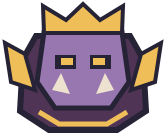

# Boss — план для согласования

08.10.2026. **Boss полностью принят пользователем, animated default включён; все четыре отчёта перенесены в docs/done.** [Art review](BOSS_ART_REVIEW.md), [animation review](BOSS_ANIMATION_REVIEW.md), [gameplay review](BOSS_GAMEPLAY_REVIEW.md). Ниже сохранён согласованный план. Следующий asset — Tower, сначала отдельный план и его подтверждение. Push без отдельного разрешения не выполнять.

## Reference и текущее состояние



[Открыть текущий рисунок](http://127.0.0.1:4175/preview/boss-reference/boss.svg). Отдельного Boss PNG/SVG reference в art/references нет. Предлагаю использовать существующий `assets/boss.svg` как ориентир образа, а принятый Archer и остальные cutout assets — как style standard. Если нужен другой образ, пользователь предоставляет/выбирает reference до art production.

Текущий Boss — фиолетовая массивная фигура с золотой короной, золотыми боковыми пластинами, жёлтыми глазами и двумя короткими клыками. SVG 166×138. MCP подтвердил `scenes/boss.tscn`: Node2D / ApproachingEnemy, Sprite2D Visual, Sprite2D SlowIndicator и ProgressBar HealthBar; collision/projectile/spawn point снаряда отсутствуют. Visual.position=(0,0), scale=(1,1), centered=true, offset=(0,0); entity origin=(0,0), scale=(1,1). HP bar offsets=(−70,−95,70,−68), SlowIndicator.scale=(1.5,1.5).

Balance существующего Boss: base HP=350, speed=70, tower_damage=50, kill_mana=30, is_boss=true. На каждой пятой волне он появляется в начале одновременно с первым обычным врагом и является дополнительным; следующий Boss получает +250 HP. EnemyStats возвращает Boss tier=0 и Color.WHITE: HP не перекрашивает его как обычного врага. Эти правила сохраняются.

## Предлагаемый внешний вид

Коронованный фиолетовый громила, шире и выше Golem, с крупной головой между широкими плечами, короткими ногами и массивными кулаками. Простая золотая корона с тремя крупными зубцами, два золотых наплечника, два коротких светлых клыка. Без оружия и мелких украшений. Attack предлагаю двумя кулаками: короткий совместный подъём и тяжёлый удар вниз, с более выраженной тяжестью корпуса, чем у обычных врагов.

Основные формы: округлый крупный корпус, большая голова, два плеча, два forearms с цельными кулаками, две короткие ноги. Корона и клыки входят в Head, наплечники — в upper arms, кулаки — в forearms. Никаких отдельных пальцев, драгоценных камней, орнаментов, плаща или сложной ткани.

Палитра: outline #29180f / 7 px на 256 canvas; фиолетовый #9876af с одной тенью #6b4b7e; тёмный корпус/броня #503456; золото #e3b552 с простым светлым #f5d581; глаза #ffd16c; клыки #efe2c9. Flat colors и максимум 1–2 shading planes. Boss сохраняет фиксированную палитру независимо от HP.

## Parts и Skeleton2D

Предлагаю восемь SVG parts и **девять Bone2D вместе с Root**:

| Part | Bone / parent | Pivot | Z |
|---|---|---|---:|
| arm_back_upper.svg | BackUpperArm / Body | заднее плечо | 0 |
| arm_back_forearm.svg | BackForearm / BackUpperArm | задний локоть | 1 |
| leg_left.svg | LeftLeg / Body | левое бедро | 2 |
| leg_right.svg | RightLeg / Body | правое бедро | 3 |
| body.svg | Body / Root | центр нижней части корпуса | 4 |
| arm_front_upper.svg | FrontUpperArm / Body | переднее плечо | 5 |
| arm_front_forearm.svg | FrontForearm / FrontUpperArm | передний локоть | 6 |
| head.svg | Head / Body | шея | 7 |

Разделение рук на два звена нужно для двухручного удара. Отдельные корона, наплечники, кисти, колени и оружие не нужны. Source folder — art/source/boss/: master.svg, parts/, rig_manifest.json, README и art preview. Все части на полном прозрачном canvas 256×256 без trimming; origin=(128,128). Точные pivots фиксируются после отрисовки и проверки art, до rig.

```text
Boss (существующая ApproachingEnemy)
  Visual / HealthBar / SlowIndicator
  BossVisual : CanvasGroup (Node2D)
    Skeleton2D
      Root
        Body
          BackUpperArm
            BackForearm
          LeftLeg
          RightLeg
          FrontUpperArm
            FrontForearm
          Head
    AnimationPlayer
```

Root.position=−origin; bone.position=pivot−parent_pivot; Sprite2D.centered=false и position=−pivot; rest явно равен исходному transform. Скрытые округлые плечи/локти/шея/бёдра продолжены под соседние части. Overlap проверяется в windup/impact/walk и mirror. Без mesh, IK, weights и root motion.

Предлагаю сохранить масштаб canvas по ширине: visual.scale=166/256=0.6484375. Текущий follow_route дополнительно масштабирует entity относительно клетки. Для 6/7/8 columns полный canvas≈119/100/85 логических px; silhouette должен помещаться внутрь canvas с полями, чтобы не закрывать соседний слот. Сравнение с Golem/Orc/Goblin обязательно при реальном размере. HP bar/SlowIndicator проверяются отдельно; при необходимости меняются только их визуальные offsets, без изменения gameplay origin/range.

## Animations и gameplay integration

- walk_loop: ориентир 1.2 s; тяжёлый короткий шаг, заметные голова/кулаки, движение entity по-прежнему задаёт gameplay.
- attack: ориентир 0.55 s, удар двумя руками, impact≈0.22 s. Подготовка перед существующим contact frame учитывает slow; урон башне не задерживается ради клипа.
- hit: ориентир 0.16 s; короткий recoil/flash.
- death: ориентир 0.45 s; короткое оседание/наклон/fade, только visual tail после немедленного outcome/reward.
- spawn_or_intro: ориентир 0.35 s; небольшой scale pulse и появление alpha. Не блокирует спавн остальных врагов, движение, targetability или урон. Без отдельной cinematic/VFX системы.

Timings являются предложением для visual, не новыми параметрами боя. Rig/animations создаются после art приёмки через MCP. BossVisual реализует принятый контракт Goblin/Orc/Golem: manual update от ApproachingEnemy, impact в исходный кадр контакта, короткий tail, очистка при stop/restart. Intro прерывается при необходимости немедленного impact/death; RESET восстанавливает alpha/scale и позу. Существующий boss reward/upgrade flow не ждёт окончания death.

Старый static Visual/asset сохраняются. После animation gate — отдельная gameplay integration/review STATIC↔ANIMATED; animated default только после полной финальной приёмки Boss.

## Риски, готовность и ручная проверка

1. До art — согласовать образ без отдельного reference: фиолетовый коронованный громила, две руки, фиксированная palette.
2. Art: силуэт/читаемость, корона и клыки на малом размере, сравнение размеров с Golem. Корона не должна выглядеть мелким узором; плечи не должны скрывать лицо.
3. Animation: overlap в локтях/плечах/шее, отсутствие дыр и двойных случайных outlines, attack на 0.5×/1×, intro без раздражающей раскачки, RESET/Pause/Mirror.
4. Gameplay: существующий spawn в начале каждой пятой волны, контакт и ровно 50 damage, slow/hit, смерть/30 mana/upgrade flow однократно, targetability, tails/restart. Баланс/волны не менять.
5. HTML5: восемь общих textures 256×256 ≈2 MiB RGBA8 без mipmaps, девять bones и один AnimationPlayer. Маски уровней Boss не нужны. Реальная performance проверяется на integration gate; физический телефон считается непроверенным без запуска. Не повторять полный игровой suite без конкретного риска.

**Все gates Boss подтверждены пользователем 08.10.2026**, включая финальную gameplay-приёмку: «принимаю, дальше». Animated default включён, отчёты архивированы; отдельный локальный commit завершает asset. CanvasGroup.self_modulate объединяет fade/flash частей, чтобы overlap не просвечивал; сама skeletal animation остаётся rigid cutout.
