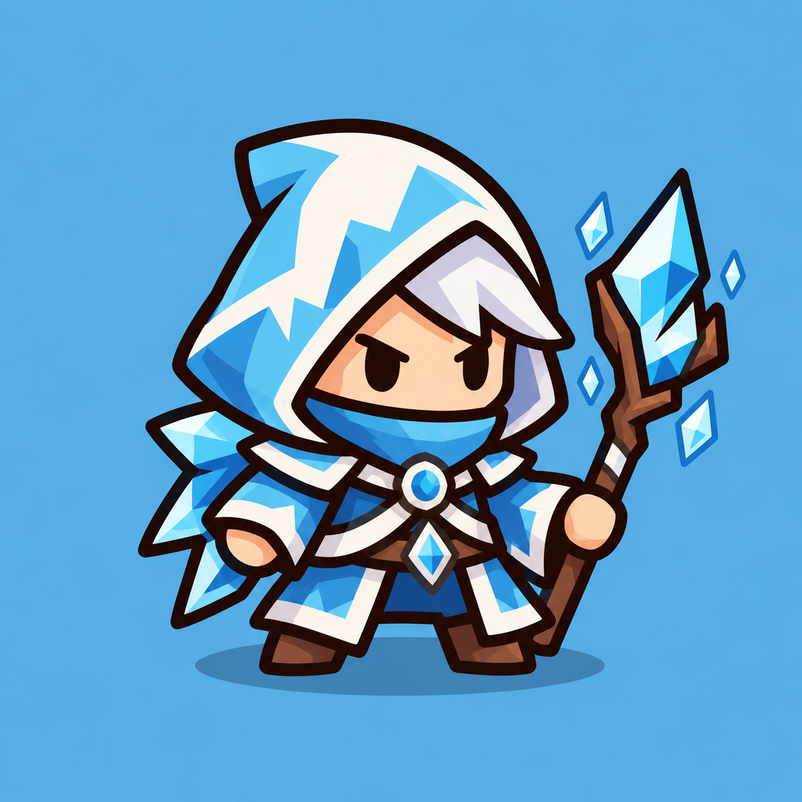

# Frost Mage — согласованный план

07.10.2026. **Frost Mage полностью принят:** план, SVG art, анимации и gameplay integration с ледяным свечением. Animated visual включён по умолчанию, static fallback сохранён. Документы перенесены в docs/done. Стандарт — [ART_PIPELINE.md](../ART_PIPELINE.md), rigid cutout. [Результаты art gate](FROST_MAGE_ART_REVIEW.md), [animation gate](FROST_MAGE_ANIMATION_REVIEW.md), [gameplay gate](FROST_MAGE_GAMEPLAY_REVIEW.md). Push только по отдельному разрешению.

## 1. Reference и фактическая entity



`art/references/frost_mage.png`, PNG 1254×1254. Крупный заострённый капюшон, белые широкие полосы, светлая чёлка, компактная мантия, короткие руки/ботинки и деревянный посох с крупным угловатым ледяным кристаллом. Парящие кристаллы вокруг посоха, синий фон и нарисованная тень не входят в runtime character art.

Godot MCP подтвердил `scenes/frost_mage.tscn`: Node2D FrostMage, скрипт CombatUnit, Sprite2D Visual с `assets/frost_mage.svg`, Marker2D Muzzle=(32,−8), projectile=`scenes/frost_bolt.tscn`. CollisionShape2D нет; target/range принадлежит gameplay. Visual scale=(1,1), position=(0,0), centered Sprite2D, без отдельного rig.

Сохраняем фактический баланс: damage Lv1–5=6/13/30/66/150, interval=0.8 s, range=280, projectile_speed=700, slow=30/40/50/60/70% на 1.5 s. Сильнейший slow и предел 70%, mana/цены/merge/waves остаются прежними. Это соответствует текущим уточнениям DEVELOPMENT_PLAN.md и существующим Resources; никакие числа не подгоняются под animation.

## 2. Силуэт и основные формы

Предлагаю широкий капюшон с одной загнутой вершиной, крупное открытое лицо, короткую угловатую чёлку, маленькую мантию и две короткие ноги. У Mage широкополая шляпа/борода, у Frost Mage капюшон/белые полосы/угловатый лёд: различимость сохраняется при одинаковом цвете уровня.

Основные формы: округлый potato-like корпус/голова, две цельные короткие руки с округлыми суставами, два ботинка, деревянный разветвлённый хват и один крупный кристалл. Сзади допускаются два крупных угловатых выступа мантии, объединённых с Body; без мелкой бахромы, отдельных тканевых сегментов или отдельной кости плаща.

Сохраняем outline #29180f, около 7 px на canvas 256×256, flat fills и один-два простых оттенка. Лицо, кисти, оружие и белая окантовка должны читаться на 100/140/180 px и на текущих малых постаментах.

## 3. Палитра и уровень

Source art — синяя ткань по reference, белая/молочная широкая окантовка, светлые волосы, тёплая кожа, коричневые кожа/дерево, cyan лёд с белым highlight. Ограниченная палитра; не переносим все мелкие грани/узоры reference.

Предлагаю сохранить единый принцип уровней: **только ткань** hood/robe/sleeves становится зелёной, оранжевой, красной, синей, фиолетовой. Белые полосы, кожа, волосы, ботинки, ремни, дерево и кристаллы сохраняют цвета. Лёд остаётся cyan при любом уровне. На integration gate маска должна исключать фиксированные ледяные детали, включая их тёмные грани/окантовку.

## 4. SVG parts

`art/source/frost_mage/master.svg`, `parts/`, простой `rig_manifest.json`, README и static review по принятому pipeline. **Восемь частей:**

| Part | Содержимое |
|---|---|
| body.svg | Мантия, широкая окантовка, ремень/пряжка и два крупных задних выступа |
| head.svg | Лицо и короткая светлая чёлка |
| hood.svg | Крупный капюшон с широкими белыми полосами |
| arm_back.svg | Свободная рука вместе с кистью |
| arm_front.svg | Рука с кистью, удерживающая посох |
| leg_left.svg | Короткий левый ботинок |
| leg_right.svg | Короткий правый ботинок |
| staff.svg | Посох и один крупный ледяной кристалл |

Hood следует Head без своей кости. Кисти не отделяем от рук; отдельные предплечья, пальцы, ремни, грани льда и кости плаща не нужны для короткого cast. Все parts — прозрачный полный canvas 256×256 без trimming; master собран из тех же shapes.

## 5. Skeleton и слои

```text
FrostMage (существующая CombatUnit entity)
├── Visual (legacy Sprite2D)
├── Muzzle (существующий gameplay anchor)
└── FrostMageVisual (Node2D)
    ├── Skeleton2D
    │   └── Root
    │       └── Body
    │           ├── Head → Head Sprite + Hood Sprite
    │           ├── BackArm → Sprite
    │           ├── FrontArm → Sprite
    │           │   └── Staff → Sprite + ReleasePoint
    │           ├── LeftLeg → Sprite
    │           └── RightLeg → Sprite
    ├── AnimationPlayer
    └── SpawnPlayer (root-only overlay)
```

Восемь Bone2D вместе с Root, восемь Sprite2D. Только rigid cutout; mesh/weights/IK/root motion не нужны. Gameplay entity двигается/переносится прежними системами; visual не выбирает цели и не создаёт projectiles.

Z-order от заднего к переднему: BackArm=0, LeftLeg=1, RightLeg=2, Body=3, Staff=4, FrontArm=5, Head=6, Hood=7. Посох перед корпусом и за удерживающей кистью; накладка капюшона обрамляет лицо и не закрывает глаза.

## 6. Pivots и overlap

Принятый workflow: actor_origin=(128,128), Root.position=(−128,−128), Sprite2D centered=false и offset=−part_pivot, Bone.position=pivot−parent_pivot. Visual.scale=100/256; UnitHost сохраняет существующий масштаб клетки. Rest явно совпадает с исходным transform.

Предварительные координаты, окончательные фиксируются вместе с SVG art в manifest:

| Part / bone | Pivot на canvas | Bone position относительно parent |
|---|---:|---:|
| Body | (127,175) | (127,175) под Root |
| Head / Hood | (128,144), шея | (1,−31); Hood без своей кости |
| BackArm | (94,158), плечо | (−33,−17) |
| FrontArm | (163,159), плечо | (36,−16) |
| Staff | (203,175), хват | (40,16) под FrontArm |
| LeftLeg | (102,211), бедро | (−25,36) |
| RightLeg | (148,211), бедро | (21,36) |

Заранее дорисовываем округлые скрытые плечи под Body, верх ботинок под мантией, шею под Hood/Body. Посох продолжается под кистью. Оверлап порядка 10–16 canvas px, затем проверка крайних поз; части не сходятся стык в стык. Координаты не восстанавливаются по случайному trimming.

## 7. Анимации и projectile

- `idle_loop`: 1.2 s, умеренное дыхание и лёгкое движение головы/посоха, без прыжков; та же базовая скорость, что у принятых Archer/Mage.
- `cast`: около 0.42 s; небольшое поднятие посоха/движение свободной руки → короткая preparation → release около 0.18 s → recovery. Никакого движения gameplay root.
- `spawn`: около 0.4 s, существующий scale/fade принцип с опорой ног на постаменте; отдельный overlay не задерживает первую атаку.

Hit/death союзнику не создаём. Подготовка следует gameplay cooldown, на прежнем кадре атаки visual выдаёт release, CombatUnit вызывает существующий frost_bolt. Muzzle=(32,−8) и его зеркалирование сохраняются; позицию кристалла/ReleasePoint согласуем с ним в release pose. Скорость recovery подстраивается под effective interval, характеристики не меняются.

Предлагаю на gameplay gate небольшой ледяной flash у посоха тем же дешёвым способом, что у Mage: opacity/scale нескольких Godot shapes перед release/на release, cyan/white. Без нового sprite sheet, particles или общего VFX pass; не заменяем существующий frost projectile/impact/slow indicator.

## 8. Интеграция и rollback

Добавляем FrostMageVisual дочерним узлом в существующую frost_mage.tscn; локально расширяем имеющийся visual contract CombatUnit на третий созданный класс. Stats/projectile resources, targeting, slow, damage snapshots, in-flight merge/reassign и refund/cancel остаются прежними. Drag использует master с тем же материалом и масштабом.

Legacy assets всех уровней сохраняются, STATIC/ANIMATED доступен в development review. Animated default включается после финальной приёмки, затем отдельный commit и перенос всех завершённых планов/отчётов в docs/done с проверкой ссылок. Push только по отдельному разрешению.

## 9. Риски и минимальная проверка

Широкий капюшон/ледяные выступы могут перегружать малый размер: ограничиваем их числом/шириной и смотрим на реальных клетках. Белые полосы не должны скрывать цвет уровня. Отдельно проверяем шейный overlap, хват посоха и ice pixels вне recolor mask. Исправляем shapes/overlap/pivots/z-order, не вводим mesh.

Web: около 2 MiB RGBA8 для восьми общих 256×256 textures плюс master для drag, восемь bones, два AnimationPlayer; небольшой локальный material/VFX. Совместимость — Godot 4.7.2, Compatibility, single-thread. Массовый enemy pass без нового риска не нужен: число защитников ограничено слотами.

Целевые проверки: art/rig на большом и игровом размере; release/reset/interruption; несколько Frost одновременно; static/animated совпадение attack cadence и slow; существующий сценарий трёх классов при изменении CombatUnit; один Web бой с переносом/merge/refund/pause/restart и console. Полный набор не повторяем без конкретной причины.

## 10. Ручные gates

1. Подтвердить этот план: силуэт, восемь частей/костей, окраска только ткани, белые полосы/лёд фиксированного цвета, короткий ледяной flash на gameplay gate.
2. После SVG art принять master/parts рядом с reference, контур/пропорции/детали и реальный размер. До этой приёмки rig не создаётся.
3. После rig принять idle/cast/spawn, joints, mirror, pause и release event в ArtAnimationTest. До этой приёмки gameplay не подключается.
4. Принять реальный бой: морозный снаряд из посоха, темп/slow прежние, цвет одежды, перенос/merge/refund/restart. Затем commit; Orc проходит отдельное обсуждение.
