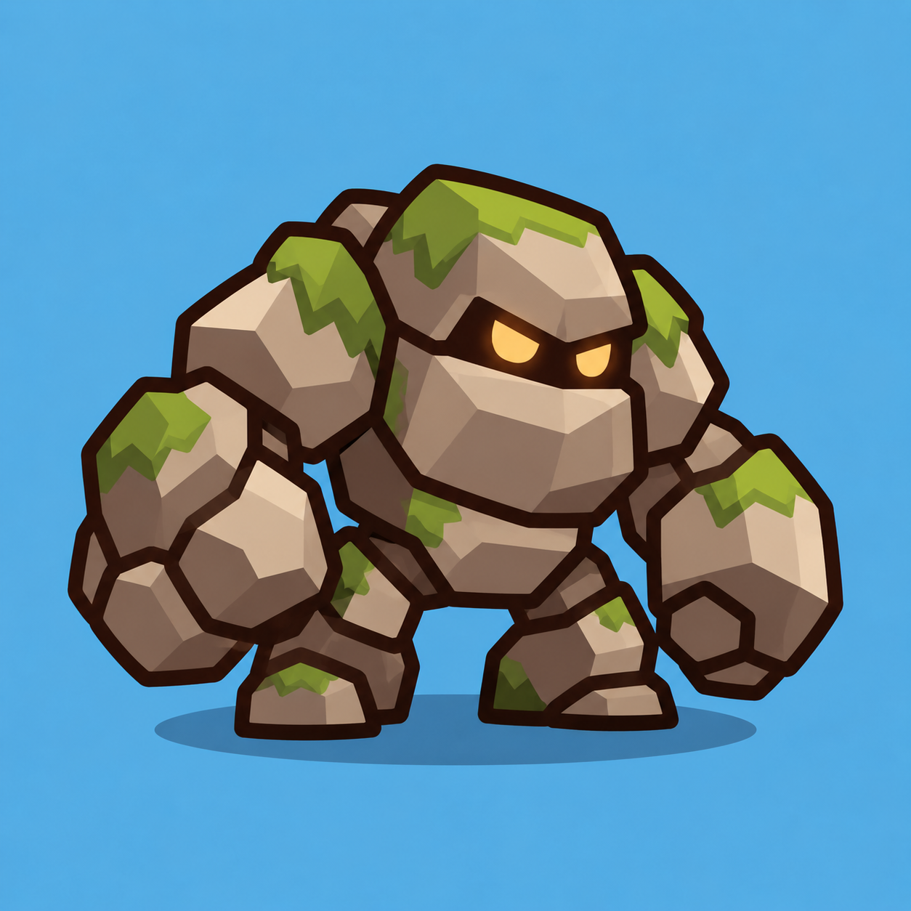

# Golem — план для согласования

08.10.2026. Archer, Goblin, Mage, Frost Mage и Orc полностью приняты. Orc зафиксирован commit `9475729`; его отчёты находятся в docs/done. **Golem полностью принят пользователем, включая art, удар двумя руками и gameplay integration. Animated default включён, старый static сохранён.** [Art review](GOLEM_ART_REVIEW.md), [animation review](GOLEM_ANIMATION_REVIEW.md), [gameplay review](GOLEM_GAMEPLAY_REVIEW.md), [просмотр art](http://127.0.0.1:4175/preview/golem-art/). Стандарт — [ART_PIPELINE.md](../ART_PIPELINE.md).

## Reference и текущее состояние



`art/references/golem.png` — PNG 1254×1254: приземистый каменный гигант, очень широкие плечи, тяжёлые кулаки, короткие ноги, маленькая светлая пара глаз в тёмной щели и крупные участки мха. Синий фон, падающая тень и множество мелких граней reference в production не переходят. Главный style standard остаётся принятый Archer: простой силуэт, толстый outline, flat colors и максимум два простых оттенка.

DEVELOPMENT_PLAN описывает Golem как врага с высоким HP и низкой скоростью. MCP подтвердил `scenes/golem.tscn`: Node2D Golem / ApproachingEnemy, Sprite2D Visual с `assets/golem.svg`, Sprite2D SlowIndicator, ProgressBar HealthBar. Visual.position=(0,0), scale=(1,1), centered=true, offset=(0,0); корневая scale=(1,1). Static SVG имеет размер 140×108. CollisionShape2D, projectile и projectile spawn point отсутствуют. HealthBar offsets=(−44,−78,44,−51); её положение будет проверено относительно нового силуэта.

`resources/balance/golem_stats.tres`: base_health=120, move_speed=80, tower_damage=20, kill_mana=8, is_boss=false. WaveManager создаёт ту же entity; ApproachingEnemy сохраняет маршрут, slow, здоровье, контакт с башней и однократный outcome. Balance, квоты, wave logic и выбор целей не меняются.

## Результат и формы

Golem должен заметно отличаться от Orc даже в небольшой клетке: шире, тяжелее, с большими каменными кулаками и без оружия. Голова низкая и частично утоплена между плечами; корпус — один крупный блок, верхние части рук — два плечевых блока, предплечья — два крупных блока с кулаками, ноги — два коротких каменных башмака. Грани крупные, округлённые; без мелких трещин, узоров, отдельных пальцев и россыпи камней.

Сохраняем существующий масштаб Golem по ширине: canvas 256×256, visual.scale=140/256=0.546875; размеры Orc=120/256 и уменьшенного Goblin=86.4/256 сохраняются. Существующий follow_route дополнительно масштабирует entity относительно клетки. Размеры нового силуэта проверяются в одной сцене с принятыми Orc/Goblin; если каменные руки выходят за клетку, упрощаем силуэт в рамках art gate. Gameplay range, скорость и координаты entity ради рисунка не меняем.

Палитра для согласования: outline #29180f, 7 px на canvas 256; камень #bba58b / #887562 / #dfcbae; тёмные промежутки #49392c; глаза #ffd16c; мох зелёный #88b96b с одним простым тёмным оттенком. Цвета исходного reference адаптируем к общей читаемой flat стилизации, не воспроизводим каждую грань.

**Продуктовое решение принято:** сложность обозначает только цвет крупных пятен мха на голове, плечах/руках и ногах. Камень, тёмные щели и жёлтые глаза остаются прежними. У Golem нет одежды, поэтому не вводим повязку или броню только ради уровня. Пороги берём из EnemyStats: 120 / 240 / 480 / 960 / 1920 HP; зелёный → оранжевый → красный → синий → фиолетовый.

## SVG parts, bones, pivots и слои

`art/source/golem/`: master.svg, parts/, rig_manifest.json, README.md и простой art preview. Все части на полном прозрачном canvas 256×256 без trimming. Ориентир origin=(128,128), feet baseline≈239; точные pivots фиксируются по принятой SVG-сборке. Предлагаю **8 частей / 9 Bone2D вместе с Root**.

| Part | Bone parent | Pivot | Z |
|---|---|---|---:|
| arm_back_upper.svg | Body | заднее плечо | 0 |
| arm_back_forearm.svg | BackUpperArm | задний локоть | 1 |
| leg_left.svg | Body | левое бедро | 2 |
| leg_right.svg | Body | правое бедро | 3 |
| body.svg | Root | нижняя часть корпуса | 4 |
| arm_front_upper.svg | Body | переднее плечо | 5 |
| arm_front_forearm.svg | FrontUpperArm | передний локоть | 6 |
| head.svg | Body | основание головы | 7 |

Кулак остаётся внутри предплечья, глаза/мох головы — внутри Head, каменные плечи — внутри верхних частей рук. Отдельные пальцы, кисти, локтевые камешки, колени, отдельная кость мха и weapon не нужны. Разделение рук на два звена оправдано тяжёлым ударом кулака; остальные части остаются цельными.

```text
Golem (существующая ApproachingEnemy)
  Visual / HealthBar / SlowIndicator
  GolemVisual
    Skeleton2D
      Root
        Body
          BackUpperArm
            BackForearm
          LeftLeg
          RightLeg
          FrontUpperArm
            FrontForearm
          Head
    AnimationPlayer
```

Root.position=−origin; Sprite2D.centered=false и position=−pivot; bone.position=pivot−parent_pivot; rest явно равен исходному transform. Скрытые округлые окончания плеч, локтей, бёдер и шеи заходят под соседние блоки. Тёмный промежуток между камнями должен оставаться частью дизайна, а не дырой до фона. Проверяем крайние вращения и mirror; overlap не должен создавать случайные двойные толстые контуры.

Маска мха и локальный материал перекрашивают только его fills с сохранением outline/теней. Материалы независимы у экземпляров, Textures общие. Не применяем цвет сложности ко всему GolemVisual. Цветовые варианты используют тот же набор частей и rig.

## Анимации и integration

- walk_loop: ориентир 1.2 s, короткие тяжёлые шаги, небольшое движение головы/плеч, читаемое движение кулаков. Entity движется с прежней скоростью; root motion отсутствует.
- attack: ориентир 0.5 s, по последующей поправке пользователя одновременный подъём обоих тяжёлых кулаков и удар двумя руками при контакте с башней, impact≈0.20 s. Подготовка укладывается в последние 0.20 s движения с учётом slow; damage происходит в прежний contact frame, без задержки ради клипа.
- hit: ориентир 0.16 s, короткий recoil/flash без остановки движения.
- death: ориентир 0.35 s, короткое оседание/наклон и fade. Цель сразу исключается из боя и выдаёт outcome/награду однократно; отдельный visual tail заканчивается и освобождается.

Это исходные visual timings для последующей animation приёмки, а не новые gameplay параметры. Spawn/idle, отдельные VFX, каменные обломки, mesh, weights, IK и новые states не входят в этот asset.

После art gate создаём `scenes/visuals/GolemVisual.tscn` через Godot MCP, следуя контракту Orc/Goblin. После animation gate подключаем к той же ApproachingEnemy, сохраняем старый Visual и review STATIC/ANIMATED. Animated default — только после финальной ручной приёмки. Collision/projectile system и сохранения не затрагиваются.

ArtAnimationTest получает только уже созданный Golem: walk/attack/hit/death, Pause, Replay, 0.5×/1×/2×, Mirror и фактический игровой масштаб. Gameplay review использует настоящий Golem и existing wave/enemy logic; сохраняет возможность сравнить Orc/Goblin и restart.

## Риски и проверки

Art: крупные кулаки могут скрыть корпус, густой outline — превратить маленькую фигуру в пятно, цветной мох — выглядеть чужеродно. До rig проверяем reference, силуэт, 100/140/180 px, реальные клетки 6/7/8 столбцов, сравнение с Orc/Goblin и пять цветов. Мох рисуем несколькими крупными patches, без зелёной текстуры или мелких листьев.

Rig: в плечах/локтях возможны щели либо чрезмерное пересечение блоков. Исправляем формы, overlap, pivots, z-order и poses; mesh без нового подтверждения не используем. Рука в attack не должна закрывать оба глаза. Ступни не должны заметно скользить или отрываться во время лёгкого walk.

Gameplay: проверяем contact frame и урон башне, slow/hit без задержки движения, однократную смерть/награду, targetability, очистку tail и restart. Новые визуальные timings подстраиваются под текущую логику.

HTML5: 8 общих textures 256×256 и маска ≈2.25 MiB RGBA8 без mipmaps, 9 bones и один AnimationPlayer на Golem; texture набор не умножается на уровень. Риск — draw calls, overdraw больших рук и число одновременно анимируемых enemies. Короткий Web замер выполняем на integration gate; физический телефон считаем непроверенным без фактического запуска. Полный gameplay suite не повторяем ради SVG или переноса docs, выбираем только затронутые сценарии.

## Ручные gates

1. PLAN принят: массивный каменный силуэт, крупный мох и его цвет сложности, 8 parts / 9 bones, сохранение gameplay размеров и характеристик.
2. После подтверждения — **только SVG art + preview**, без rig. Пользователь принимает внешний вид и пять цветов.
3. Затем rigid rig/animations и отдельная приёмка poses, overlap, тяжести шага/удара, reset/interruption, mirror и малого размера.
4. Затем настоящий бой и финальная приёмка. После неё — animated default, перенос отчётов в docs/done и отдельный commit. Push только по отдельному разрешению.

Все четыре gates Golem приняты. [Итог gameplay](GOLEM_GAMEPLAY_REVIEW.md). Отчёты перенесены в docs/done, animated default включён. Push только по отдельному разрешению; следующий asset обсуждается отдельно.
