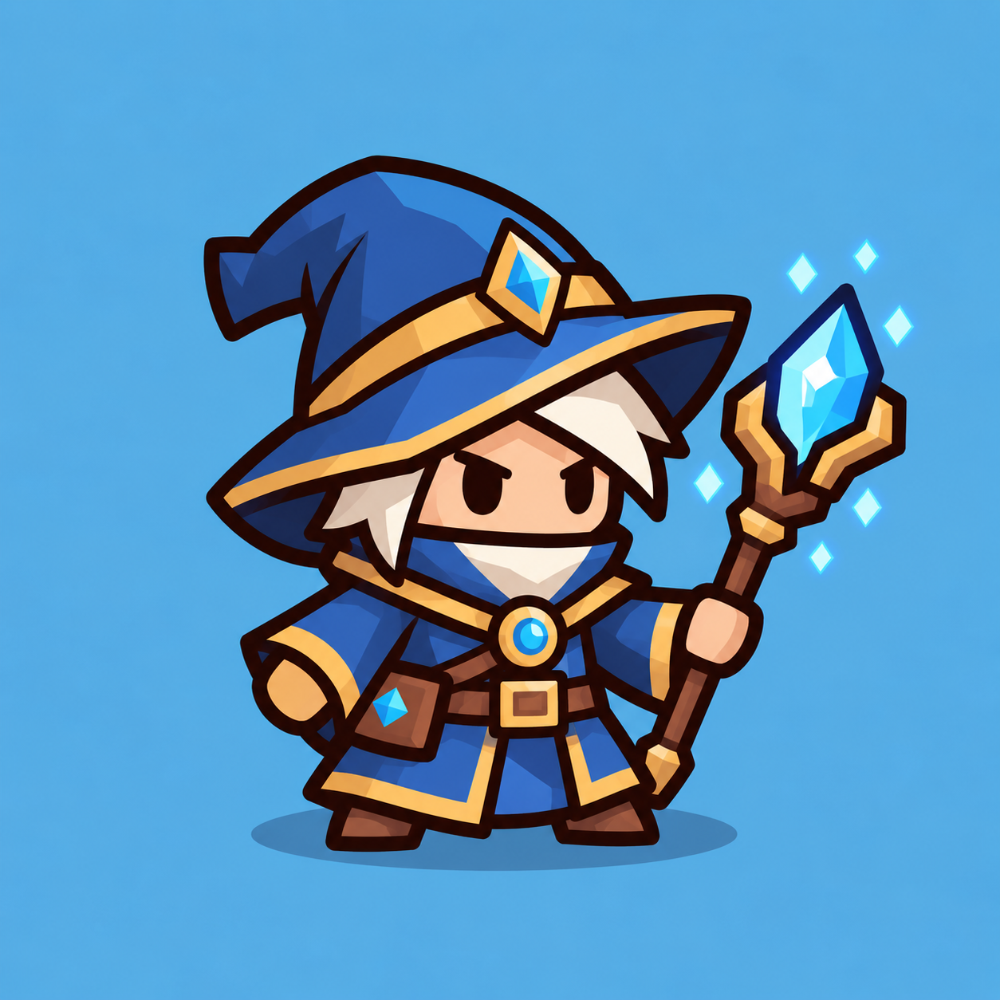

# Mage — план для согласования

07.10.2026. **Mage полностью принят пользователем**, включая art, rig/animations, idle 1.2 s, gameplay integration и свечение посоха. Animated visual включён по умолчанию; static fallback сохранён. Goblin принят, commit `9eaac0a`; Archer принят, commit `847ccfc`. Стандарт — [ART_PIPELINE.md](../ART_PIPELINE.md), rigid cutout. Документ сохраняет исходный согласованный план.

## 1. Reference и текущая gameplay entity



Reference — `art/references/mage.png`, PNG 1254×1254. Широкая синяя шляпа с загнутой вершиной, золотая окантовка, белые волосы и короткая борода, компактная мантия, короткие ботинки и деревянный посох с крупным голубым кристаллом. Синий фон, нарисованная тень и парящие декоративные кристаллы не входят в runtime character art.

Godot MCP подтвердил текущую сцену `scenes/mage.tscn`: Node2D Mage, скрипт `scripts/combat/combat_unit.gd`, Sprite2D Visual с `assets/mage.svg`, scale=(1,1), position=(0,0), centered=true, offset=(0,0). Marker2D Muzzle=(32,−8). Projectile scene — `scenes/fireball.tscn`, texture `assets/fireball.svg`, существующий `CombatProjectile`. В сцене Mage нет физической collision shape; range и target selection рассчитывает gameplay.

Не изменяем характеристики: Lv1 damage=24, attack_interval=1,2 s, attack_range=260, projectile_speed=700, остальные уровни/модификаторы/цены/merge/HP/waves также сохраняются. Gameplay entity — Mage/CombatUnit; новый визуал — отдельный дочерний MageVisual. Союзник не получает урон и не умирает.

## 2. Силуэт и основные формы

Главные признаки: широкие поля и изогнутая вершина шляпы, небольшое лицо под полями, короткая трапециевидная мантия, две толстые руки и короткие ноги, крупный ромб кристалла справа. Пропорции squat, как у принятого Archer; шляпа и посох дают узнаваемость на маленьком размере.

Упростить складки, пояс и сумку до нескольких крупных форм. Сумка/пряжка входят в Body, украшение шляпы — в Hat, лицо/волосы/борода — в Head, кисти — в руки, ботинки — в ноги. Не добавлять мелкие ремешки, пальцы, руны или текстуры. Небольшое число flat highlights/shadows; outline #29180f, 7 px на 256×256, round joins/caps.

Mage должен отличаться от остальных союзников формой шляпы и крупного оправленного кристалла независимо от цвета уровня. Производство Frost Mage сейчас не начинается.

## 3. Палитра и уровни — предложение для подтверждения

| Область | Предлагаемые исходные fills |
|---|---|
| Outline | #29180f |
| Ткань шляпы/мантии | синий #3568b6, тень #254b85, свет #5488d0 |
| Кожа | #ffc18c / #de9668 |
| Волосы/борода | #f3e7ce / #d4c4a8 |
| Золотая окантовка | #e5b34f / #b87a32 |
| Дерево/кожа/ботинки | #895334 / #613821 |
| Кристалл посоха и брошь | #56d9ed / #2999c0 / #b5f4f4 |

Static art preview сохраняет синюю ткань reference. В gameplay **только ткань шляпы, мантии и рукавов** получает существующий цвет уровня: Lv1 зелёный, Lv2 оранжевый, Lv3 красный, Lv4 синий, Lv5 фиолетовый. Кожа, волосы, борода, золото, дерево, ботинки, сумка и кристаллы сохраняют цвета. Один rig и набор textures на все уровни. Локальный материал выделяет только ткань; если цветовой фильтр задевает брошь/окантовку, используем одну общую SVG-маску, как у Goblin.

Принцип цвета ткани принят вместе с планом; новые skins/equipment системы не создаются.

## 4. Минимальные SVG parts

`art/source/mage/master.svg`, `parts/` и простой `rig_manifest.json`:

1. `body.svg` — мантия, пояс, пряжка, сумка и брошь.
2. `head.svg` — лицо, белые волосы и короткая борода.
3. `hat.svg` — вся шляпа, окантовка и украшение; следует Head без собственной кости.
4. `arm_back.svg` — свободная рука вместе с рукавом и кистью.
5. `arm_front.svg` — рука с посохом вместе с рукавом и кистью.
6. `leg_left.svg` — короткая нога/ботинок.
7. `leg_right.svg` — короткая нога/ботинок.
8. `staff.svg` — посох вместе с оправой и кристаллом.

**8 частей**, без разделения кистей/пальцев/локтей/кристалла на дополнительные sprites. Hat отдельно позволяет менять ткань независимо от лица, но отдельное движение шляпы пока не требуется. Цельные руки достаточны для короткого cast; добавление forearm только после обнаруженного ограничения и отдельного обсуждения.

## 5. MageVisual.tscn и bones

```text
Mage : Node2D                         # существующая gameplay entity
  Visual : Sprite2D                   # сохранённый static fallback
  Muzzle : Marker2D                   # существующий gameplay anchor
  MageVisual : Node2D
    Skeleton2D
      Root : Bone2D
        Body : Bone2D / Sprite2D
          Head : Bone2D / Sprite2D
            Hat : Sprite2D
          BackArm : Bone2D / Sprite2D
          FrontArm : Bone2D / Sprite2D
            Staff : Bone2D / Sprite2D
          LeftLeg : Bone2D / Sprite2D
          RightLeg : Bone2D / Sprite2D
    AnimationPlayer
    SpawnPlayer                       # независимый spawn overlay как у Archer
```

**8 Bone2D вместе с Root**. Staff следует FrontArm, Hat следует Head. Rigid sprites, без mesh/weights/IK/constraints/root motion. Сцену, узлы, rest и animation tracks создаём через Godot MCP только после принятия art.

## 6. Pivots и overlap

Все части — прозрачный, необрезанный canvas 256×256. Actor origin=(128,128), ступни около y=239; визуальный canvas в gameplay ориентировочно 100 логических px, как у Archer, с существующим масштабом UnitHost. Точная примерка фиксируется на art gate.

Body — центр корпуса, Head — шея, руки — плечи, ноги — бёдра, Staff — хват. Hat использует pivot Head. Координаты записываем в manifest при создании art: local pivot, parent bone, default position, sprite offset, z-order. Root=−actor_origin; Sprite2D centered=false, position=−pivot; Bone.position=pivot−parent_pivot; rest равен исходному transform.

Плечи продолжаются под мантией, ноги — под её подолом, шея — под головой, посох продолжается за кистью. Закруглённые скрытые участки перекрываются с запасом на крайние наклоны; внешние strokes не должны открывать щели.

## 7. Z-order — предложение

BackArm 0, LeftLeg 1, RightLeg 2, Body 3, Staff 4, FrontArm 5, Head 6, Hat 7. Свободная рука частично за корпусом; рука с посохом перед мантией; кисть закрывает хват посоха, как в reference. Голова закрывает плечо, поля шляпы закрывают верх головы. Проверяем, что поднятый кристалл не пропадает за полями шляпы и outline вокруг хвата остаётся читаемым.

## 8. Реальные animations

- `idle_loop`: первоначально около 2,4 s, слабое дыхание, небольшой наклон головы/посоха; без прыжков. На animation review пользователь 07.10.2026 попросил ускорить idle Mage и Archer вдвое: текущий цикл 1,2 s при прежней амплитуде.
- `cast`: ориентировочно 0,42 s, короткое поднятие посоха/отклонение свободной руки → anticipation → release около 0,18 s → recovery → idle. Точные keys и длительности принимаются отдельно на animation gate.
- `spawn`: около 0,4 s, небольшой scale/fade без изменения слота или задержки первого выстрела; независимый overlay, как у Archer.

RESET — техническое восстановление позы. Союзнику не создаём hit/death. Отдельный сложный merge animation/VFX pass не входит в задачу.

## 9. Projectile synchronization и integration

CombatUnit сохраняет поиск целей, cooldown, `_fire()` и существующий fireball. MageVisual сообщает только визуальный release. Подготовка cast проходит во время оставшегося cooldown; seek не вызывает ранних событий. На прежнем кадре готовности visual переводится на release и CombatUnit вызывает прежний `_fire()` ровно один раз.

Не задерживаем первый выстрел/новую доступную цель ради полного замаха. Speed клипа подстраивается под существующий effective attack interval. При потере цели/переносе подготовка отменяется; pause/stop/restart останавливают callbacks. Никаких новых damage/cooldown правил.

Фактический projectile spawn остаётся `Muzzle.global_position`, локально (32,−8), с прежним зеркалированием. Положение кристалла в release pose подгоняется к этому anchor: при canvas scale=100/256 ориентир около (210,108) на SVG. Уровни, damage snapshot, скорость, target validation, merge/reassign и refund/cancel сохраняются. `assets/fireball.svg` используется, новая система снарядов не создаётся.

Добавляем MageVisual соседним узлом в существующую `scenes/mage.tscn`; локально расширяем visual-вызовы CombatUnit для Mage, сохраняя принятый Archer. Static visual и STATIC/ANIMATED review остаются; animated normal default только после финальной приёмки Mage. Drag preview использует master с тем же масштабом и одеждой уровня. В review доступны только уже созданные assets.

## 10. Риски и HTML5

- Широкая шляпа и высокий посох могут мешать соседним слотам; проверяем реальный размер и silhouette, сначала правим форму.
- Голубой кристалл Mage и общая цветовая кодировка не должны скрывать различие классов; основная различимость — силуэт.
- Перекраска ткани может затронуть брошь/золотую отделку; проверяем маску и материалы на пяти уровнях.
- Хват и плечо не должны открывать щели при cast/mirror.
- После расширения CombatUnit проверяем принятый Archer и прежний projectile lifecycle, особенно disappearance/move/merge/refund.
- 8 общих textures 256×256 — примерно 2 MiB RGBA8; optional mask ещё ~0,25 MiB, master для drag ещё ~0,25 MiB. Это оценка текстур, не полной памяти Web. 8 bones и 8 Sprite2D на Mage; textures общие для экземпляров. Compatibility/single-thread сохраняются. Проверка нескольких Mage и короткий Web бой; новый массовый enemy/performance pass без конкретного риска не нужен.

Rigid cutout остаётся принятым стандартом. Если обнаружится видимая проблема ткани, сначала shape/overlap/pivot/z-order/keys; mesh без отдельного разрешения не используется.

## 11. Ручные gates и критерии

**Art:** reference consistency, chunky proportions, шляпа/кристалл читаются при 100/140/180 px и реальном игровом масштабе, ограниченная палитра, единый outline, без мелких украшений. Сначала показываем master/parts; до ручной приёмки art rig не создаётся.

**Animation:** idle спокойный; cast читается на 0.5×/1×, хват/плечи/шея без дыр; spawn не ломает reset; mirror, pause, replay и interruption корректны. До ручной приёмки animation gameplay integration не начинается.

**Gameplay:** несколько Mage одновременно, fireball из прежнего Muzzle на release, темп/урон/цели прежние, пять цветов только ткани, move/swap/merge/refund/drag/pause/restart, static fallback и отсутствие runtime/browser errors. Короткие целевые проверки и затронутые существующие scenarios; полный набор без необходимости не повторяем. Финальная ручная приёмка → отдельный commit. Push только по отдельному разрешению.

## 12. Что подтверждается сейчас

Силуэт по Mage reference; 8 SVG parts и 8 bones; цельные руки; отдельная Hat без отдельной кости; три animations; одежда уровня только на ткани; посох за кистью, перед корпусом; существующий fireball/Muzzle/timing. **После подтверждения выполняется только SVG art и preview, затем остановка для приёмки внешнего вида.**

Все этапы Mage полностью приняты; [art gate](MAGE_ART_REVIEW.md), [animation gate](MAGE_ANIMATION_REVIEW.md), [финальная приёмка в бою](MAGE_GAMEPLAY_REVIEW.md). Animated Mage включён в обычной игре. Push только по отдельному разрешению. Следующий asset — Frost Mage, сначала отдельное обсуждение плана.
