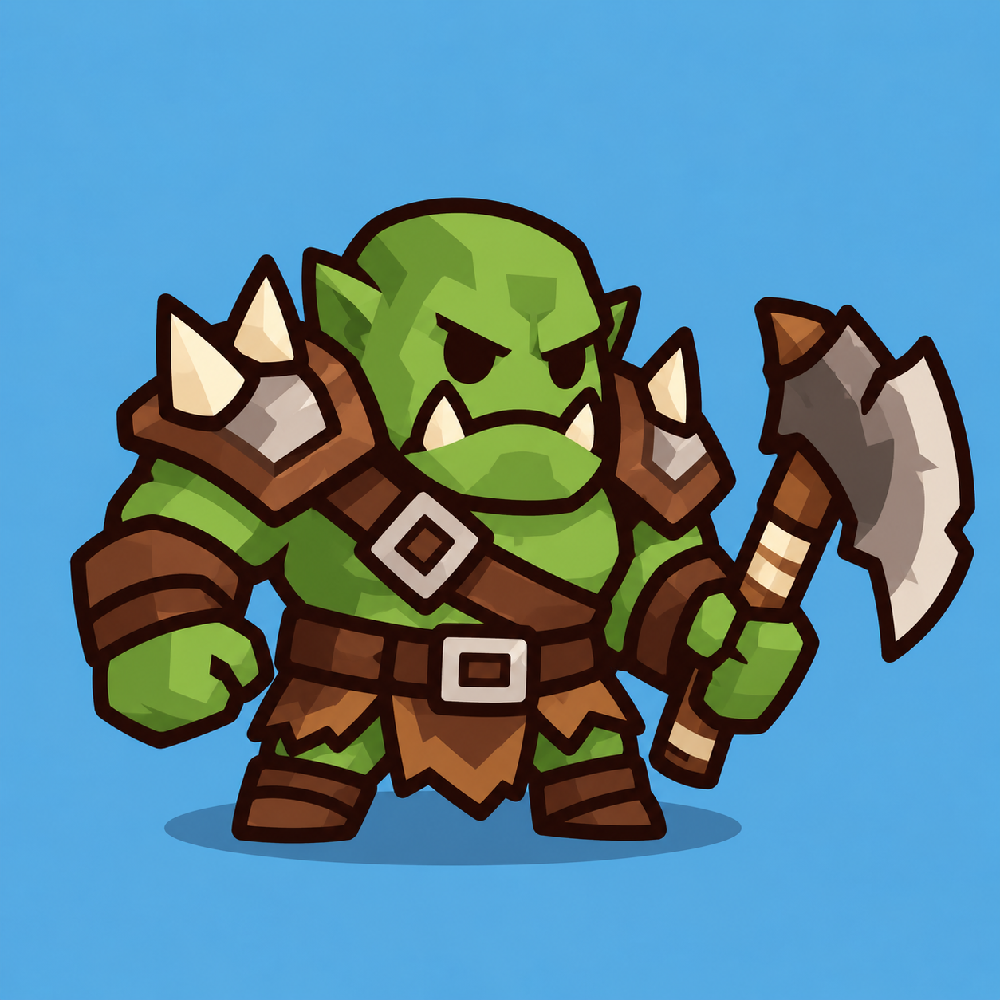

# Orc — план для согласования

08.10.2026. **Orc полностью принят**, включая rigid cutout, gameplay integration, окраску одежды и уменьшение Goblin на 20%. Этот документ сохраняет согласованный план. [Art gate](ORC_ART_REVIEW.md), [animation gate](ORC_ANIMATION_REVIEW.md), [gameplay gate](ORC_GAMEPLAY_REVIEW.md), [просмотр боя](http://127.0.0.1:4175/preview/orc-gameplay/). Стандарт — [ART_PIPELINE.md](../ART_PIPELINE.md). Push только по отдельному разрешению.

## Reference и существующий gameplay



Reference: `art/references/orc.png`, PNG 1254×1254. Зелёный приземистый воин, широкие плечи, два крупных наплечника, два клыка, короткие ноги и большой одноручный топор. Синий фон, тень и мелкие грани reference не переходят в production art.

Godot MCP подтвердил `scenes/orc.tscn`: Node2D Orc, скрипт `scripts/combat/approaching_enemy.gd`, Sprite2D Visual с `assets/orc.svg`, Sprite2D SlowIndicator и ProgressBar HealthBar. Visual.position=(0,0), scale=(1,1), centered=true. Исходный SVG 120×88; Node2D дополнительно масштабируется существующим follow_route относительно размера клетки. CollisionShape2D, projectile и projectile spawn point у Orc отсутствуют. Старый static visual сохраняется.

Баланс `resources/balance/orc_stats.tres`: base HP=60, speed=120, tower damage=20, kill mana=5. WaveManager спавнит ту же gameplay entity; ApproachingEnemy ведёт маршрут, здоровье, slow, контакт с башней и outcome. Ничего из этого art pass не меняет. По DEVELOPMENT_PLAN Orc остаётся врагом средней скорости и здоровья.

## Предлагаемый внешний вид

Силуэт шире и массивнее Goblin: крупная округлая голова, короткий широкий корпус, большие плечи, маленькие кисти и ступни. Габарит сохраняем в пределах существующей клетки; не увеличиваем enemy entity, range или collision ради рисунка. Топор и два клыка — главные отличительные формы, наплечники упрощаем до крупных округлых пластин с одним-двумя широкими шипами. Без мелких ремней, царапин и текстур металла.

Палитра: outline #29180f, 7 px на canvas 256×256; кожа #7fa443 / #5f8134 / #a0bf60, нейтральные ремни/дерево #895334 / #613821, металл #8d8981 / #625e59 / #c5c0b6, клыки/шипы #f3e7ce. Flat fills и максимум два простых оттенка, как у принятых assets.

Предлагаю аналог Goblin: **уровень сложности меняет только ботинки, напульсники и набедренную повязку**. Кожа остаётся зелёной, наплечники/металл, ремни, лицо, клыки и топор сохраняют свои цвета. Цвета и пороги берём из существующего EnemyStats: зелёный → оранжевый → красный → синий → фиолетовый при удвоениях max HP от базового. Для Orc границы 60/120/240/480/960 HP. Source brown fills в этих трёх областях выделяет отдельная маска Orc, используя уже принятый equipment shader Goblin.

## Части, кости, pivots и слои

`art/source/orc/`: master.svg, parts/, rig_manifest.json, README.md и простой preview. Всего **семь частей и восемь Bone2D вместе с Root**. Лицо/клыки/уши входят в голову, кисти и наплечники — в руки, ботинки — в ноги, пояс/повязка — в body. Отдельных пальцев, локтей, шипов и костей брони не нужно.

| Part | Parent bone | Pivot / rotation origin | Z |
|---|---|---|---:|
| arm_back.svg | Body → BackArm | плечо | 0 |
| leg_left.svg | Body → LeftLeg | бедро | 1 |
| leg_right.svg | Body → RightLeg | бедро | 2 |
| body.svg | Root → Body | нижняя часть корпуса | 3 |
| axe.svg | FrontArm → Axe | хват рукояти | 4 |
| arm_front.svg | Body → FrontArm | плечо | 5 |
| head.svg | Body → Head | основание головы | 6 |

Топор перед корпусом и за удерживающей кистью. Голова закрывает скрытые окончания плеч. Наплечники двигаются вместе с руками; если крайнее вращение открывает стык, исправляем форму/overlap, а не добавляем mesh.

Workflow pivots тот же: все части на полном canvas 256×256 без trimming, actor_origin=(128,128), baseline ступней y≈239. Root.position=−origin, Sprite2D.centered=false и position=−pivot; bone.position=pivot−parent_pivot; rest совпадает с исходным transform. Точные координаты и default positions измеряются по принятой SVG-сборке и фиксируются в manifest до rig. Округлые окончания рук, ног и шеи заходят под соседние формы; стыков впритык нет.

```text
Orc (существующая ApproachingEnemy)
  Visual / HealthBar / SlowIndicator (сохранены)
  OrcVisual
    Skeleton2D
      Root
        Body
          Head
          BackArm
          FrontArm
            Axe
          LeftLeg
          RightLeg
    AnimationPlayer
```

`scenes/visuals/OrcVisual.tscn` и небольшой `scripts/visuals/orc_visual.gd` следуют принятому контракту Goblin. В ApproachingEnemy выбирается существующий GoblinVisual либо OrcVisual. Visual не создаёт enemies, не меняет здоровье, движение, награды или wave state. STATIC/ANIMATED переключается в development review; animated default только после финальной приёмки.

## Анимации и синхронизация

- walk_loop: ориентир 0.8 s, заметное качание головы и руки с топором, короткий шаг. Движение entity целиком остаётся в ApproachingEnemy; root motion отсутствует.
- attack: ориентир 0.4 s, pose impact≈0.18 s — короткая подготовка топора и удар при контакте с башней. Подготовка подстраивается под оставшееся время до контакта, учитывая slow. Урон наносится в прежний contact frame, без ожидания клипа и остановки Orc.
- hit: около 0.16 s, короткий recoil/flash; не останавливает движение.
- death: около 0.32 s, короткое оседание/наклон и fade. Gameplay entity сразу теряет targetability, разрешает волну/награду ровно один раз и удаляется; только visual заканчивает анимацию и освобождается, как у Goblin.

Длительности — стартовые визуальные ориентиры для последующей приёмки animation, не новые gameplay параметры. Spawn, idle, projectile, дополнительные states и VFX pass Orc не нужны.

## Проверки и риски

Сначала только SVG preview: рядом с reference и Goblin, master/parts, 100/140/180 px, постаменты и фактический телефонный размер, пять цветов одежды. После ручной приёмки art — rig/animations через MCP и добавление только Orc в ArtAnimationTest.

На animation gate проверяем overlap в крайних позах, отсутствие щелей/пересечений топора с лицом, устойчивость ступней, Mirror, RESET, interruption и Pause; 0.5×/1×/2× и реальный scale. Особенно важны крупный топор и наплечники: они могут мешать соседним врагам, скрывать HealthBar или выйти за canvas.

На gameplay gate — ходьба по поворотам, slow, hit/death, единственный урон башне в прежний момент, награда за убийство и завершение волны, очистка tails при restart. Достаточны целевые проверки затронутого enemy-контракта и один Web прогон; полный набор без нового риска не повторяем.

HTML5: семь общих textures 256×256 + одна equipment mask, восемь bones и один AnimationPlayer на Orc. Не создаём textures для каждого уровня. Риски — дополнительные draw calls и прозрачный overdraw в больших волнах. Сначала измеряем конкретную нагрузку; mesh, pooling и большие textures не вводим заранее. Физический телефон проверяется отдельно при наличии устройства.

## Что пользователь принимает вручную

1. План: силуэт массивнее Goblin, упрощённые наплечники/топор, неизменная зелёная кожа и цвет сложности только на трёх областях одежды.
2. Art: соответствие reference, читаемость головы/клыков/топора, поза и опора на малом размере, контур и palette.
3. Animation: заметность ходьбы, хват топора, подготовка/удар, короткие hit/death, отсутствие дыр и clipping.
4. Gameplay: прежняя скорость/slow/damage/outcomes, нормальное завершение волны и restart. Только после этого animated default, перенос документов в docs/done и отдельный commit.

**Все gates Orc приняты 08.10.2026. Animated default включён, legacy visual сохранён; отчёты перенесены в docs/done для отдельного commit.**
