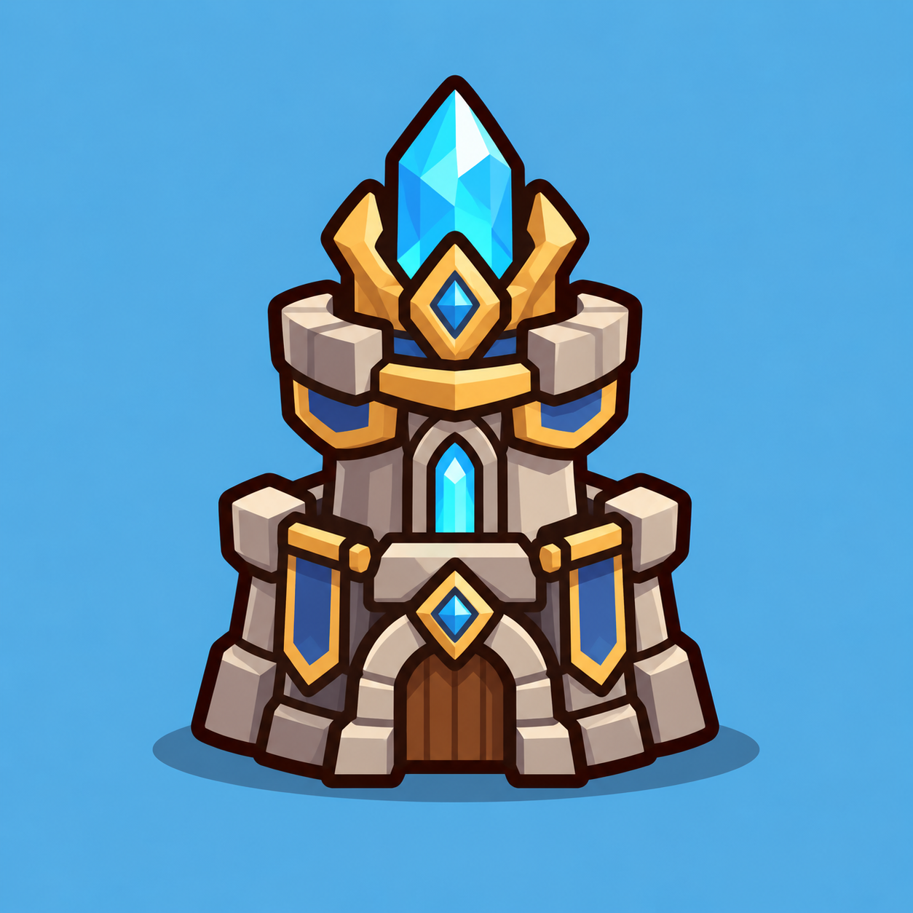

# Summoner Tower — план для согласования

08.10.2026. Boss полностью принят, commit `27a10e5 art: add animated boss`. Последний asset master art pass — Summoner Tower — **полностью принят пользователем**, animated default включён, Web обновлён, отчёты архивированы в docs/done. Push не выполнялся.

## Reference



[Открыть референс](http://127.0.0.1:4175/preview/tower-reference/reference.png), [текущий рисунок](http://127.0.0.1:4175/preview/tower-reference/current.svg).

Главный образ — `art/references/tower.png`, PNG 1254×1254: каменная башня с крупным голубым кристаллом, золотой оправой, синими вставками/знамёнами и коротким широким основанием. Blue background референса не входит в runtime art. Ориентир толщины outline и простоты форм — принятые Archer / Golem / Boss.

## Фактическая архитектура

Godot MCP подтвердил нужный проект C:/Gamedis/summoner-tower, Godot 4.7.2 / Compatibility. Прочитаны PackedScene и scene tree Tower; несохранённых сцен нет.

- Gameplay entity: `scenes/tower.tscn`, Node2D / `scripts/combat/tower_health.gd` (TowerHealth). Используется как World/Tower в scenes/game.tscn и наследующих её debug scenes.
- Visual: Sprite2D Visual → `assets/tower.svg`, SVG168×182, viewBox=(−84,−108,168,182). Это простая башня с золотой треугольной крышей, голубым окном и дверью. В сцене position=(0,−17), scale=(1,1), centered=true, offset=(0,0). Root position=(0,0), scale=(1,1).
- ContactPoint: Marker2D, в исходной сцене position=(0,−120). При процедурном build `fit_to_cell` устанавливает ContactPoint=(0,0) и Visual.position=(0,0), scale=size/182. Это фактический runtime anchor: рисунок не должен изменять контакт или длину дороги.
- SummonButton: прозрачный Button, исходный rect=(−100,−120,200,196); в процедурном runtime занимает текущую клетку. Нажатие передаёт summon_requested в GameManager / SummonManager. Новая визуализация не заменяет эту input logic.
- CostLabel: отдельный Label, исходный rect=(−68,−9,136,44). В runtime position=(−size/2,size×0.06), size=(size,34), font28. Текст — только цена, цвет зависит от доступности призыва.
- ReturnZone: Node2D / `scripts/game/unit_return_zone.gd`, прямоугольная hit area, Highlight и RefundLabel. В runtime rect соответствует клетке; возврат сохраняет 50% реально потраченной маны.
- Physics collision / projectile spawn point у башни нет. Контакт, input и возврат задаются Marker2D / Button / Rect2.
- HP100 задаются first_encounter.tres, run bonuses могут увеличивать maximum. Health / destroyed / summon signals связаны с GameManager и HUD. Destroyed защищён флагом, здоровье и Game Over происходят сразу; текущий static при уничтожении затемняет Tower root.
- Battlefield управляет клеткой / позицией башни, GameManager — завершением боя, SummonManager — экономикой. Новый TowerVisual отображает состояние и не управляет этими системами.

## Предлагаемый результат

Башня в стиле референса: крупный cyan кристалл над каменным корпусом, простая золотая оправа, два широких синих элемента и низкий арочный вход. Силуэт широкий, устойчивый, с узнаваемой верхушкой; пропорции squat / chunky, толстый тёмный outline.

Уточнение пользователя: добавить реакцию на тап и на продажу / возврат бойца. Тап подтверждается коротким пружинящим движением корпуса и вспышкой кристалла. При успешном возврате бойца кристалл даёт отдельный синий импульс, как при поглощении энергии. Реакции различимы и сопровождают существующие операции без задержки призыва или начисления маны.

Оставить читаемые крупные формы. Вручную упростить референс: мало крупных каменных плоскостей, один верхний кристалл, один золотой пояс/оправа, простые синие вставки. Мелкие дополнительные gems, многочисленные швы, узоры и тонкие рамки не нужны. Последнее уточнение пользователя при приёмке ART: при внедрении придвинуть цифру призыва вплотную к нижнему краю башни. Цена остаётся отдельным CostLabel, без новой подписи или UI панели; нижний край цифр привязать к неподвижному основанию и проверить в Godot при 6/7/8 columns.

Ограниченная flat palette: outline #29180f / 7 px на 256; камень #b8a99a, тень #81756f, свет #d8c8b3; золото #e3b552 / #f5d581; синий #355fa1; кристалл #28cce6 / #159bc9 / #b5f7fb; дверь тёмно-коричневая #805035. Не использовать raster textures или image generators: production art — ручной SVG-код.

## SVG parts, pivots и слои

Предлагаю **три части, ноль bones**:

| Part | Содержимое | Pivot / положение | Порядок |
|---|---|---|---:|
| base.svg | Нижний каменный цоколь, дверь / арка | Общий actor origin; base неподвижен | 0 |
| crystal.svg | Один крупный cyan кристалл с 2–3 гранями | Центр / основание кристалла в CrystalPivot | 1 |
| body.svg | Верхний корпус, золотая оправа, синие вставки | BodyPivot в центре корпуса | 2 |

Золотая оправа перед нижней частью кристалла. Ornament elements остаются внутри Body; отдельные знамена / gems / камни / двери не нужны для согласованных анимаций. Точные pivot coordinates фиксируются после SVG art, до AnimationPlayer.

Source: `art/source/tower/master.svg`, `parts/`, `rig_manifest.json`, README и preview. Все три parts — полный прозрачный canvas 256×256 без trimming; actor_origin=(128,128), baseline=250.1. После замечания пользователя о слишком маленькой башне силуэт увеличен на 15% по ширине и 10% по высоте внутри прежнего canvas: фактический размер близок к текущему static. Pivots пересчитаны; у кристалла остаётся небольшой запас для pulse, а цена располагается поверх тёмного входа.

Sprite.centered=false. Base.position=−actor_origin; BodyPivot.position=body_pivot−origin и Body Sprite.position=−body_pivot; CrystalPivot аналогично. Скрытые части оправы / кристалла и стык body/base продолжаются с overlap. Полноценный Skeleton2D для башни не нужен.

## Godot visual

```text
Tower (существующий TowerHealth)
  Visual                    # legacy static
  TowerVisual : Node2D
    Base : Sprite2D
    CrystalPivot : Node2D
      Crystal : Sprite2D
    BodyPivot : Node2D
      Body : Sprite2D
    AnimationPlayer
  ContactPoint              # прежняя gameplay position
  ReturnZone                # прежний rect / highlight / refund
  SummonButton              # прежний input
  CostLabel                 # цифра поверх visual
```

Базовый слой 0, crystal 1, body 2; CostLabel выше art, z_index=10, ReturnZone highlight сохраняет слой5. Pivots анимируют только art, не ContactPoint / Button / Rect2 / Label. TowerVisual и animations resources созданы через MCP и подключены к TowerHealth. Нижний край обводки цифр совпадает с нижним краем Base.

Размер нового visual при fit_to_cell=size/256 для полного canvas. Сама клетка и bounds Button / ReturnZone остаются прежними. В ArtAnimationTest Tower получает отдельную примерку под размер клетки, без постамента союзника; новый пункт Tower добавляется после Boss.

## Анимации

| Clip | Предложение | Gameplay |
|---|---|---|
| crystal_pulse | ~1.6 s loop: мягкая пульсация cyan/яркости, scale примерно 1→1.03→1 | Только visual, без HP / mana / summon событий |
| tap | ~0.16 s: лёгкое сжатие / восстановление корпуса и короткая вспышка кристалла | Подтверждение принятого нажатия существующего SummonButton; призыв не ждёт клипа |
| refund | ~0.26 s: кристалл слегка сжимается, затем расширяется и вспыхивает синим, как при поглощении энергии | Запускается после успешной продажи / возврата; мана начисляется в прежний момент |
| hit | ~0.18 s: короткий recoil / flash корпуса и кристалла, base устойчив | Урон и health_changed происходят в прежний кадр |
| destroyed | ~0.45 s: кристалл гаснет, корпус слегка оседает / наклоняется, остаётся затемнённая башня | destroyed / Game Over не ждут окончания клипа |

Все пять animations через один AnimationPlayer, RESET восстанавливает позу / цвет. Реакции tap / refund делаются transform / color animation трёх существующих частей; отдельные textures, particles, ring и sprite sheets для них не нужны. Idle не раскачивает весь объект. Destroyed — visual, не новая физическая модель обломков.

Приоритет: destroyed → hit → refund → tap → crystal_pulse. Hit сохраняет читаемую реакцию на урон; действие, пришедшее во время hit, показывается после него, если башня жива. Достаточно одной ожидающей visual reaction, refund приоритетнее tap. Повторные действия не создают длинную очередь. Destroyed отменяет ожидающие реакции и удерживает финальную позу. Это только порядок visual clips: игровые операции выполняются сразу.

## Интеграция и fallback

После приёмки анимаций TowerHealth выбирает STATIC / ANIMATED и сообщает visual состояние initialize / tap / refund / hit / destroyed. Tap привязывается к принятому нажатию существующего SummonButton, его disabled-состояние сохраняется. Refund привязывается к существующему SummonManager.unit_refunded(amount), который отправляется после успешной операции; отменённое перетаскивание и отпускание вне башни реакцию продажи не запускают. Обычное начисление маны за убийство не считается продажей.

Gameplay HP, сигналы, расчёт цен, bonus max HP, возврат, contact point и Game Over сохраняются. При animated destroyed затемняется TowerVisual, а legacy root tint остаётся для static fallback: общий tint не должен накладываться дважды или менять независимый CostLabel.

Initialize возвращает crystal_pulse. Удары не блокируют input или gameplay; уничтоженная башня остаётся остановленной игровыми системами. Restart создаёт чистый visual. Старый assets/tower.svg и Sprite2D сохраняются; animated default включается только после финальной приёмки Tower.

## Риски и проверки

- Gameplay клетка существенно меньше reference: проверить 100/140/180 px и реальные размеры 6/7/8 columns, включая экран шириной390. Кристалл, камень и цена должны читаться без увеличения art.
- Новый силуэт не закрывает соседние слоты / HUD и помещается в существующую клетку. Верхний кристалл не меняет дорогу или input area.
- Цена не перекрывается оправой / кристаллом и не исчезает от hit или destroyed tint. Button и ReturnZone обрабатывают мышь / touch как раньше.
- Hit / destroyed меняют только visual transforms. Current health и Game Over нельзя задерживать ради анимации; repeated damage / destroyed не дублируют события.
- Проверить reset, прерывание pulse / tap / refund ударом и смертью, повторные hits, быстрые нажатия / продажи, pause и restart. Удержание уничтоженной позы не запускает pulse или action reaction снова.
- Мышь и touch дают одинаковую tap reaction без двойного события. Успешная продажа показывает refund reaction один раз; отмена продажи и обычная награда за убийство её не вызывают. Мана и новый юнит появляются без ожидания animation.
- Три общие textures256×256 ≈0.75 MiB RGBA8 без mipmaps, один AnimationPlayer, 0 bones; custom shader / CanvasGroup не планируется, если прозрачность частей не потребуется. Web Compatibility, single-thread; performance проверить на gameplay gate вместе с остальными accepted assets.
- Целевая проверка по gate, без повторения полного набора тестов для каждого изменения art. Native — импорт / сцена / короткие проверки; Web — совместить бой, summon/refund, input, размеры, поражение и restart.

## Ручной checklist и gates

1. PLAN: подтвердить образ по tower.png и упрощение до трёх частей, 0 bones, pulse / tap / refund / hit / destroyed.
2. ART: проверить кристалл / основание / палитру / silhouette, соответствие reference, читаемость при маленьком размере и свободное место для цифры цены. Затем остановка для приёмки.
3. ANIMATION: pulse ненавязчив, tap и refund различимы, hit короткий, destroyed понятен, Replay / Pause / reset работают. Отдельная приёмка всех пяти clips в ArtAnimationTest.
4. GAMEPLAY: призыв по башне с реакцией на тап, цена и её отключённое состояние, успешный возврат 50% с отдельной реакцией, отмена продажи, быстрые действия вместе с hit, damage / Game Over, upgrade max HP, pause / restart. Финальная приёмка, затем default / отдельный commit / docs/done. Push по отдельному разрешению.

**PLAN / ART / ANIMATION / GAMEPLAY приняты.** [Просмотр рисунка](http://127.0.0.1:4175/preview/tower-art/), [отчёт ART gate](TOWER_ART_REVIEW.md), [просмотр animations](http://127.0.0.1:4175/preview/tower-animation/), [отчёт ANIMATION gate](TOWER_ANIMATION_REVIEW.md), [обычная игра](http://127.0.0.1:4175/), [отчёт GAMEPLAY gate](TOWER_GAMEPLAY_REVIEW.md). Следующий автоматический art/VFX pass после Tower не запускать: сначала отдельное обсуждение дальнейшей работы.
